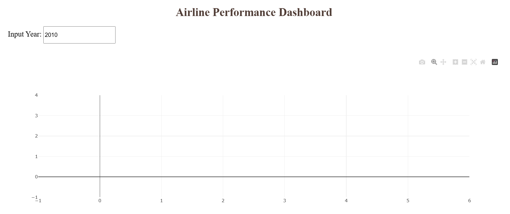

# Airline Performance Analysis ✈️

This project, part of the **Data-Analysis-Projects** repository, explores airline performance using data visualization and statistical analysis. The notebook **Airline-Performance.ipynb** includes **19 plots** (18 static, 1 animated) to help uncover patterns and insights in airline operations.

Since GitHub does not render plots from notebooks by default, screenshots and a GIF have been added for clarity.

---

## 📊 Project Overview

This analysis covers:

- Flight delays and cancellations
- Airline and airport performance trends
- Passenger traffic over time
- Weather impact on flights
- Animated hourly flight behavior

---

## 📷 Visualization Gallery

> These are static images and an animated GIF for quick preview.  
> For interactive versions, open the notebook locally.

### 🖼️ Static Plots

**1. Distance vs Departure Time**  


**2. Month vs Average Flight Delay Time**  


**3. Total number of flights to the destination state split by reporting airline**  


**4. Total number of flights to the destination state split by reporting airline**  


**5. Scatterplot: Reporting Airline vs Flight**  


**6. DestCityName proportion**  


**7. Delay by Time of Day**  

**8. Average Delay by Day of Week**  


**9. Top Delayed Airlines**  


**10. Route Popularity**  


**11. Histogram of Flight Delays**  


**12. Scatterplot: Delay vs Distance**  


**13. Boxplot by Carrier**  


**14. Average Departure Delay by Month**  


**15. Correlation Matrix**  


**16. Total Flights Over Time**  


**17. Delay by Aircraft Type**  


**18. Day vs Night Delay Comparison**  


---

### 🎞️ Animated Visualization

**19. Hourly Delay Pattern (GIF)**  


---

## 🚀 Run Locally

To view the full interactive analysis:

```bash
git clone https://github.com/yourusername/Data-Analysis-Projects.git
cd Data-Analysis-Projects
jupyter notebook Airline-Performance.ipynb
```

Ensure the `plots/` folder is in the same directory for the README visuals to display properly.

---

## 📌 Dependencies

```bash
pip install pandas numpy matplotlib seaborn plotly scikit-learn
```

---

## 📃 License

This project is licensed under the MIT License.
```

---

Let me know if you want the plot captions updated with your actual plot titles or descriptions.
