 ### Interactive Airline Performance Dashboard built with:

- **Python** for backend logic and data manipulation

- **Plotly Express** & **Graph Objects** for dynamic and beautiful data visualizations

- **Dash** for building responsive and interactive web applications

- **Pandas** & **NumPy** for efficient data preprocessing and statistical calculations

---
# Airline Performance

This project, part of the **Data-Analysis-Projects** repository, explores airline performance using data visualization and statistical analysis. The notebook **Airline-Performance.ipynb** includes **19 plots** (18 static, 1 animated) to help uncover patterns and insights in airline operations.

Since GitHub does not render plots from notebooks by default, screenshots and a GIF have been added for clarity.

---

## Project Overview

This analysis covers:

- Flight delays and cancellations
- Airline and airport performance trends
- Passenger traffic over time
- Weather impact on flights
- Animated hourly flight behavior

---

## Visualization Gallery

> These are static images and an animated GIF of final dashboard.  
> For interactive versions, open the notebook locally.

**Flight Delay Time Statistics**  
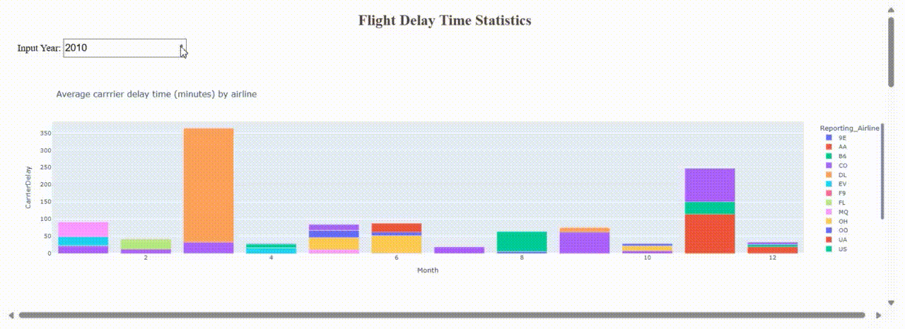

### Static Plots

**1. Scatter Plot**  
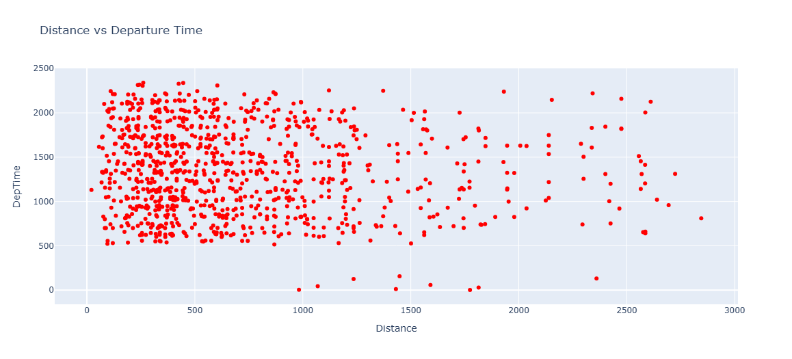

**2. Line Plot**  
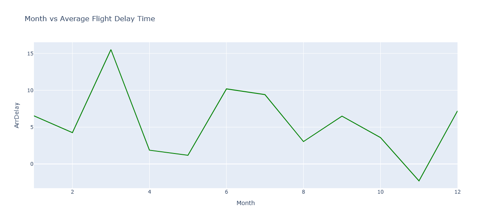

**3. Bar Plot**  
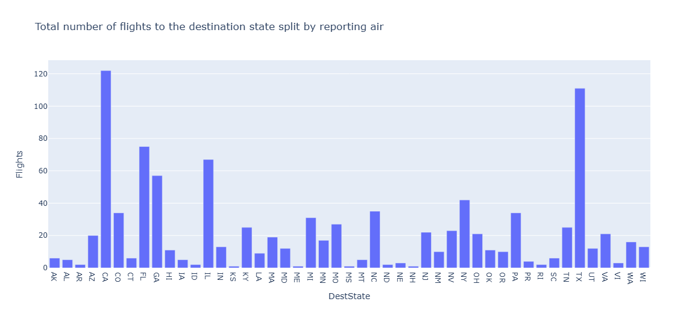

**4. Histogram**  
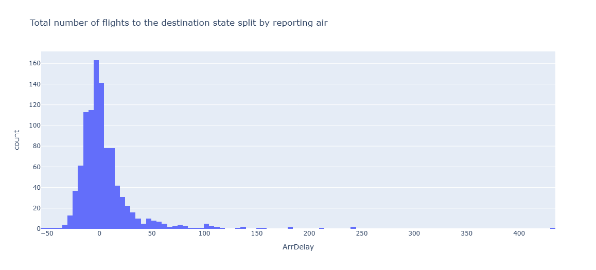

**5. Bubble Plot**  
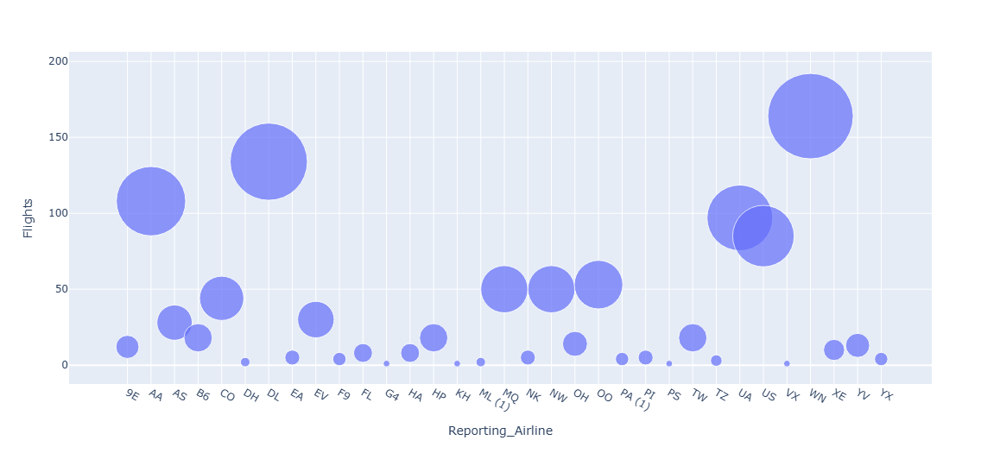

**6. Pie Plot**  
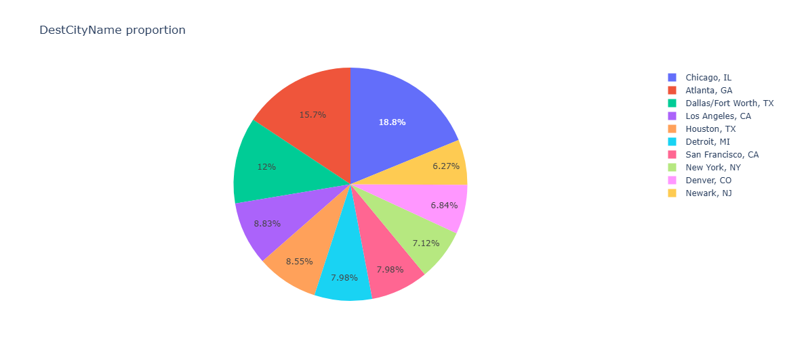

**7. Sunburst**  
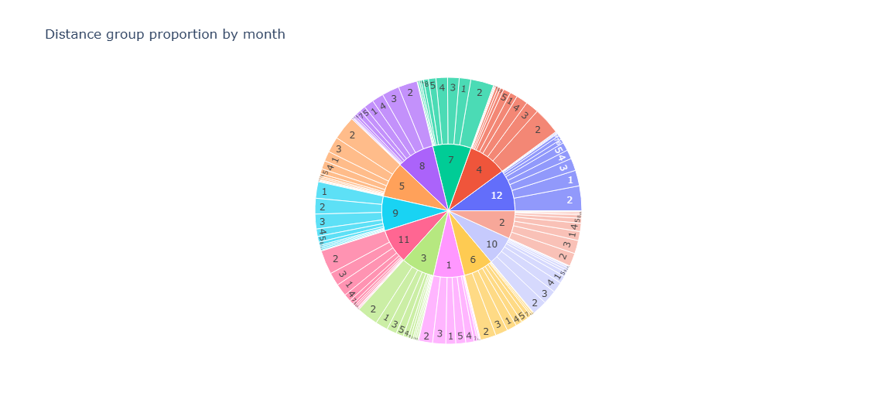

**8. Sunburst**  
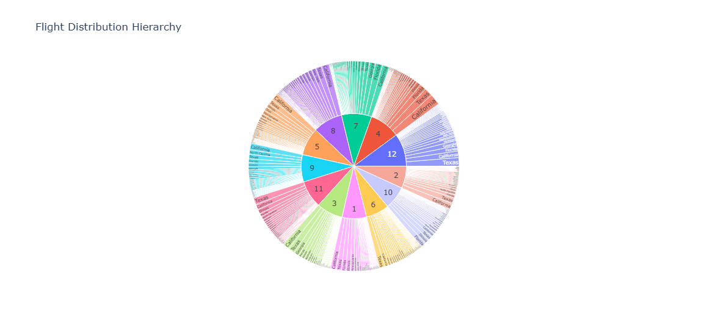
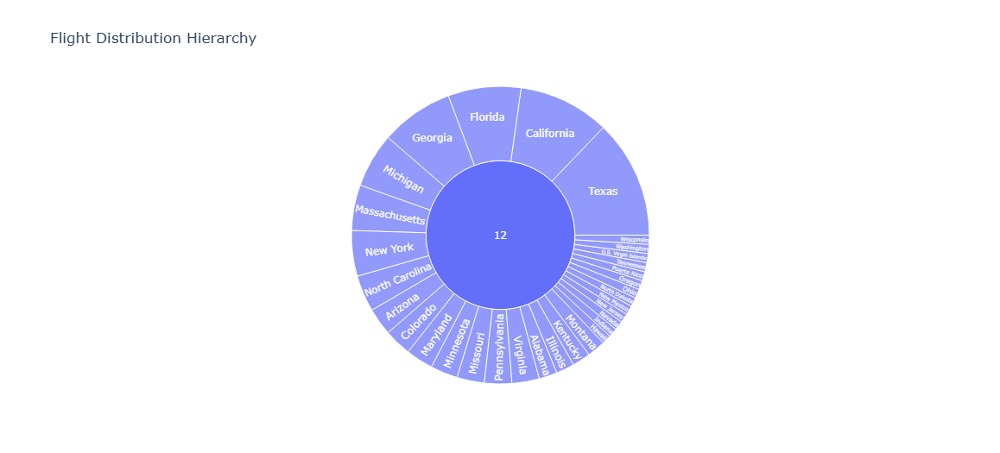

**9. Plotting Line Plot for Different Year using Dash**  
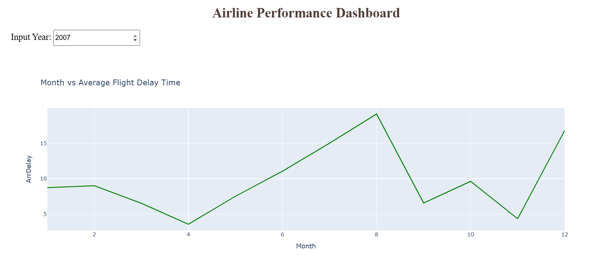

**10. Plotting Bar Plot for DIfferent Year using Dash**  
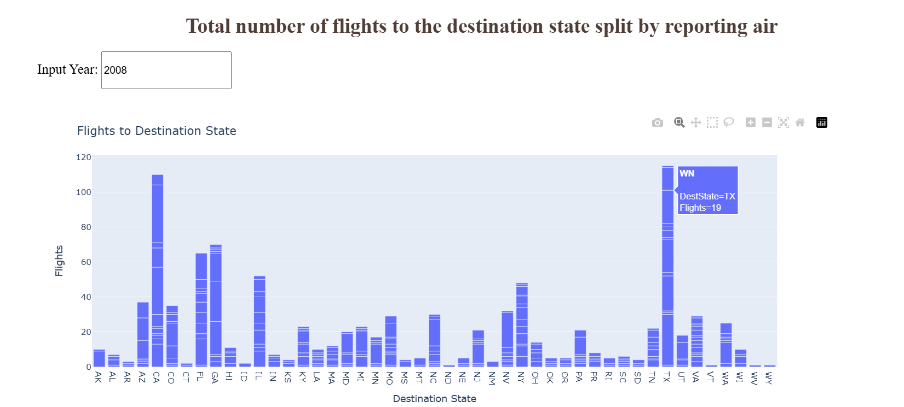

---

## Dependencies

```bash
pip install pandas numpy matplotlib seaborn plotly scikit-learn
```

---

## 📃 License

This project is licensed under the MIT License.
