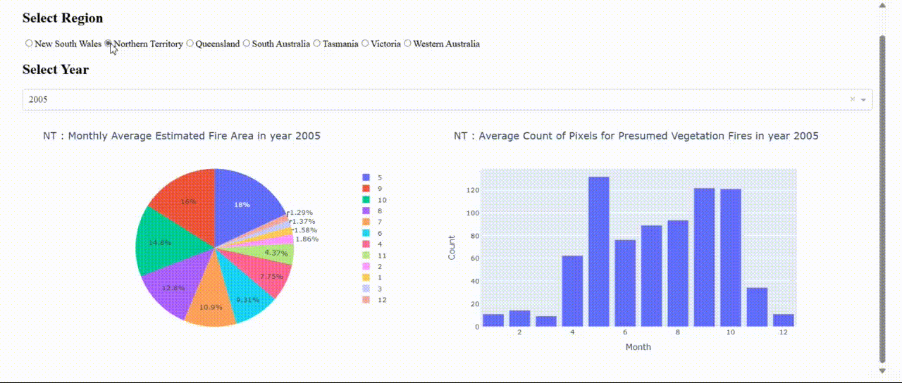
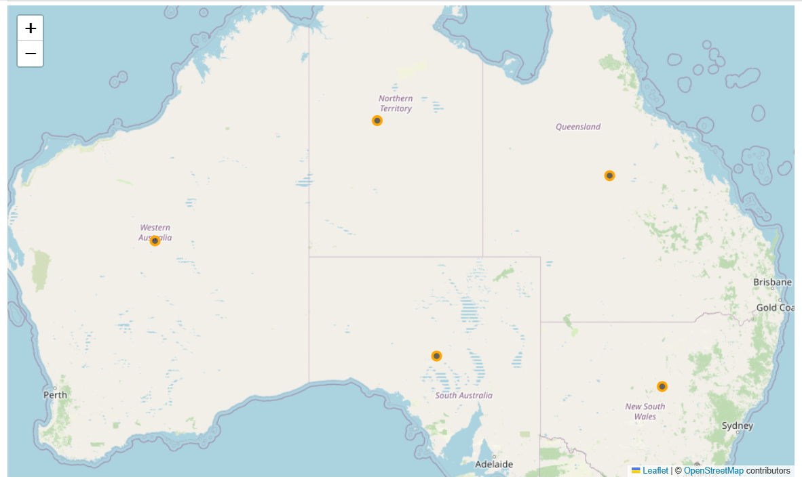

 ### Interactive Wildfire Analysis Dashboard built with:
- **Python** for backend logic and data manipulation
- **Plotly Express** & **Graph Objects** for dynamic wildfire visualizations
- **Pandas** & **NumPy** for efficient data preprocessing and statistical calculations
- **Folium** for geographic mapping of wildfire occurrences
- **Seaborn** & **Matplotlib** for insightful visual analysis of trends and distributions

# Wildfires in Australia Analysis
This project analyzes historical wildfire data across different regions of Australia to uncover insights into fire behavior, intensity, and geographic patterns over time. The analysis includes:

- Trends in estimated fire area over the years
- Monthly trends during peak years (2010–2013)
- Brightness intensity across regions
- Vegetation fire pixel counts by region
- Histogram of fire brightness
- Correlation between fire power and confidence level
- Interactive map of wildfire-prone regions
- An interactive dashboard using Dash to explore monthly trends by region and year

---

## Visualization
- **Dashboard**

- **Different Regions in Australia**

---

## 📁 Dataset Reference

* [Historical\_Wildfires.csv](https://cf-courses-data.s3.us.cloud-object-storage.appdomain.cloud/IBMDeveloperSkillsNetwork-DV0101EN-SkillsNetwork/Data%20Files/Historical_Wildfires.csv)

---

## 🧠 Insights

* Fire area significantly increased in the early 2010s.
* NT and WA are most affected in terms of vegetation fire pixel counts.
* There's a moderate correlation between fire radiative power and confidence levels.
