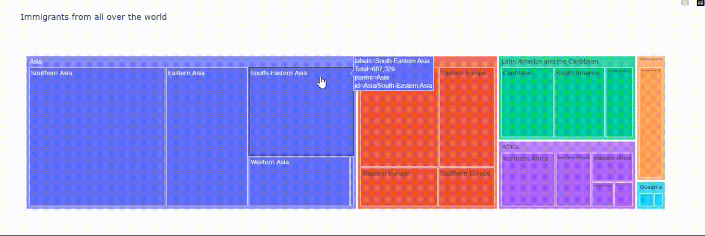

### Interactive Canada Immigration Visualization built with:
- **Pandas**: Data wrangling and manipulation
- **NumPy**: Efficient numerical operations
- **Matplotlib & Seaborn**: Static and statistical plotting
- **Plotly**: Interactive visualizations
  
---
# Canada Immigration Data Analysis (1980–2013)
The objective of this project is to analyze **historical immigration data (1980–2013) to Canada from over 190 countries**, uncovering key trends, regional shifts, and data-driven insights. The findings aim to support policymakers, researchers, and the public in understanding how immigration patterns have evolved over time.

---

## Key Insights

✔️ Top 5 countries contributing to Canadian immigration over the decades  
✔️ Immigration trends by continent and region  
✔️ Detection of outlier years and pattern anomalies  
✔️ Animated GIF of immigration growth for top countries  
✔️ Comparative analysis using line plots, area charts, and heatmaps

---

## Visualizations Included

1. Bar chart of total immigrants by country
2. Area chart: Top 5 countries over time
3. Line plots: Asia, Europe, Africa, Latin America trends
4. Pie chart: Proportional regional distribution
5. Interactive plots using Plotly
6. Tree map: Proportion of immigrants in different continents and regions

---
## License
This project is licensed under the MIT License.
