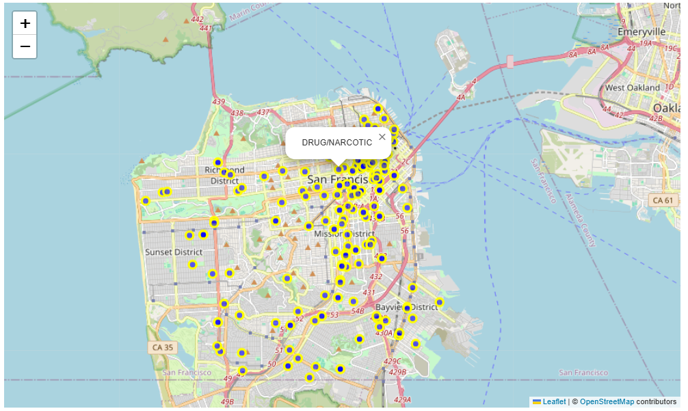
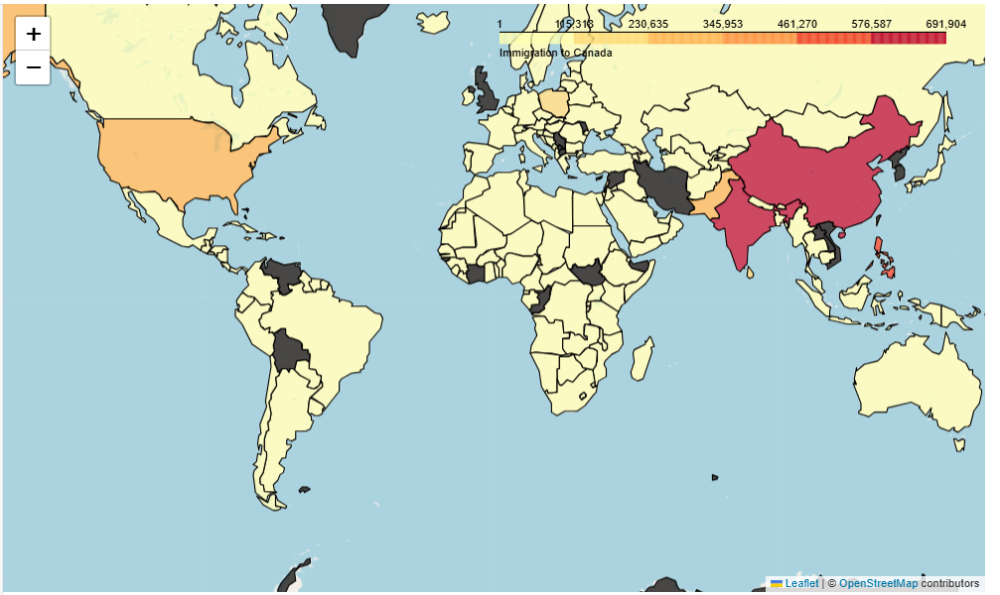

### Interactive Map Visualization built with: 
- **Python** for backend logic and data manipulation  
- **Pandas** & **NumPy** for data preprocessing  
- **Folium** for interactive map plotting  
- **Folium Plugins** for clustering and enhanced visualization  

---

# Sanfrancisco Police Data

This project utilizes **Folium** to visualize geographical data, including crime locations in **San Francisco** and **global immigration trends**. It incorporates **interactive markers, clustering techniques, and choropleth maps** for insightful geographic analysis.  

## Key Features:  
- **Base Map Rendering** → Generates customizable maps with different tile styles.  
- **Crime Locations in San Francisco** → Uses **CircleMarkers** and clustered points to visualize crime incidents across the city.  
- **Interactive Markers** → Displays **crime categories** through popups in mapped locations.  
- **World Immigration Choropleth** → Maps **immigration data** using **color gradients** to illustrate migration patterns globally.  
- **Marker Clustering for Crime Data** → Groups nearby crime points for better readability in dense locations.  

---

## Visualization Gallery
- Crime Distribution in San Francisco (CircleMarkers)

- Global Immigration to Canada (Choropleth Map)


- Marker Clustering for Crime Points


---

## Dependencies  

```bash
pip install pandas numpy folium
```

---

## License  

This project is licensed under the MIT License.

