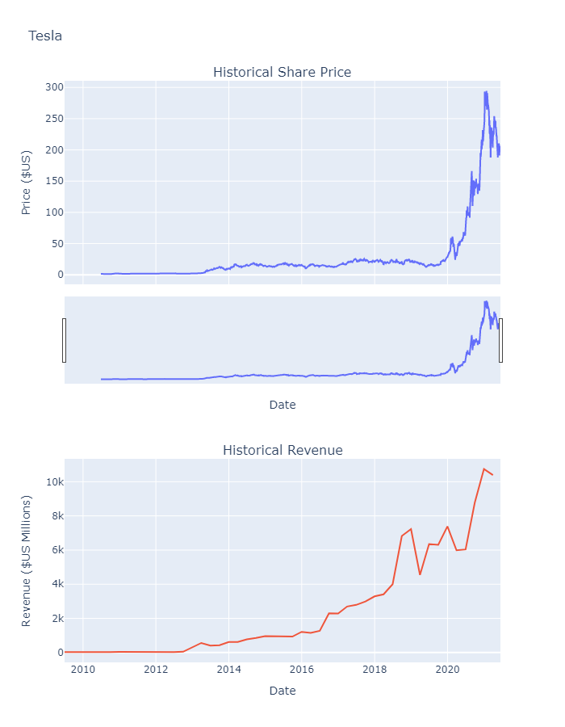
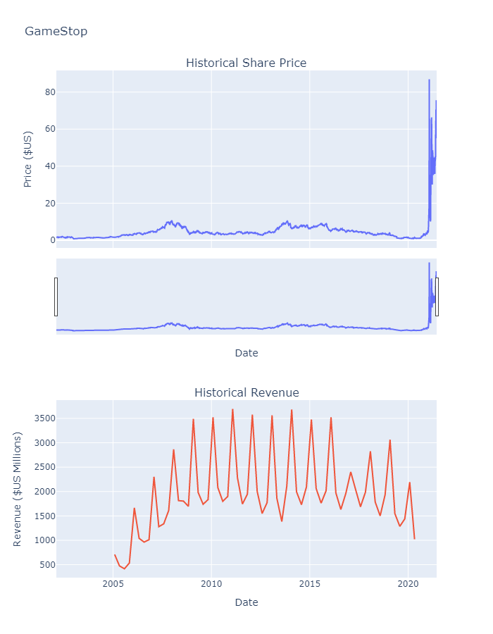

# Stock Data Analysis
## Overview
This project is designed to analyze historical stock data and revenue information for companies like Tesla and GameStop. I use various libraries including `yfinance`, `pandas`, `requests`, `BeautifulSoup`, `plotly`, `mplfinance`, and `matplotlib` to fetch data, process it, and visualize it.

## Dependencies
Make sure you have the following packages installed:
- yfinance
- pandas
- requests
- BeautifulSoup
- plotly
- mplfinance
- matplotlib

You can install them using:  
`pip install yfinance pandas requests beautifulsoup4 plotly mplfinance matplotlib`

## Code Structure
- **Fetch Data**: I use the `yfinance` library to fetch historical stock data for Tesla and GameStop.
- **Process Data**: I process the fetched data using `pandas` and `BeautifulSoup`.
- **Visualization**: I use `plotly`, `mplfinance`, and `matplotlib` to create various visualizations, such as candlestick charts and bar graphs.

## Functions
### make_graph
````python
def make_graph(stock_data, revenue_data, stock):
    # Code to create graphs
````
This function creates subplots showing historical share prices and revenue.

## Visualizations
The output of the `make_graph` function is saved and included in this README for reference.
### Tesla Graph 


### GameStop Graph 


## GameStop Stock Analysis
### How to Run
1. Clone the repository:
````bash
git clone [https://github.com/yourusername/data-analysis-project.git]
````
2. Navigate to the project directory:
````bash
cd Data-analysis-project/Stock_Data_Analysis
````
3. Run the script:
````bash
jupyter notebook Stock_Data_Analysis.ipynb
````

## Contact
For any queries, please contact [zahraahmadbeigloo@gmail.com].
