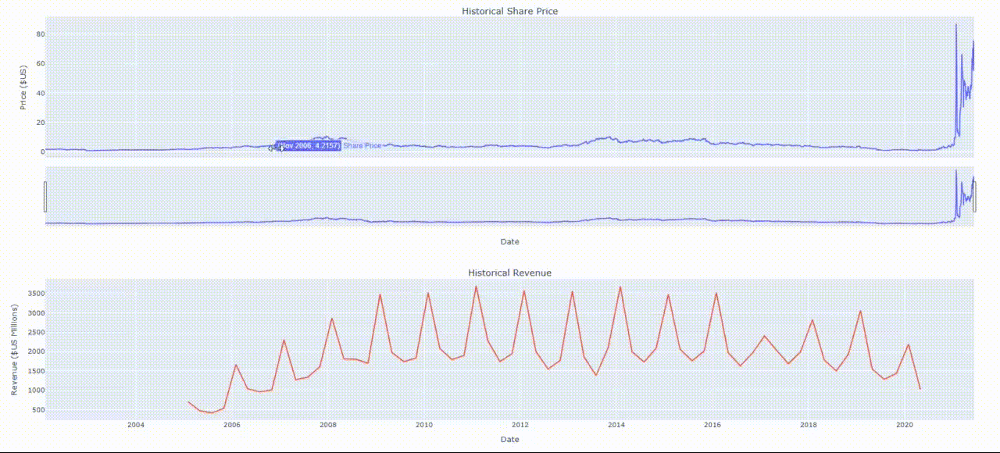

### Stock Data Analysis & Visualization Dashboard built with:

- **Python** for backend logic and financial data processing
- **Plotly**, **matplotlib**, and **mplfinance** for compelling stock and revenue visualizations
- **BeautifulSoup** & **Requests** for web scraping financial revenue data
- **yFinance** for seamless access to historical and real-time market data
- **Pandas** for efficient data manipulation and transformation

---
# Stock Data Analysis
## Project Overview

This project focuses on extracting and visualizing stock and revenue data for two prominent companies: **Tesla (TSLA)** and **GameStop (GME)**. It presents trends in share prices, revenue, and trading volume using multiple interactive and static plots. The project uses a combination of APIs, scraping, and financial data visualization libraries to present an insightful stock analysis dashboard.

---

## Key Features

* Real-time and historical stock data fetching with **yFinance**
* Revenue data scraping with **BeautifulSoup**
* Interactive dual-axis plots of **stock price vs. revenue**
* Candlestick charts to show daily open-high-low-close patterns
* Year-wise trend lines for closing prices (2022 & 2023)
* Volume bar chart for GameStop over the last 6 months

---

## Workflow Summary

1. **Import Libraries**

   * yFinance, Pandas, Plotly, matplotlib, mplfinance, BeautifulSoup

2. **Fetch Stock Data**

   * Tesla and GameStop historical data via `yfinance.Ticker().history()`

3. **Scrape Revenue Data**

   * Tesla revenue from HTML tables using BeautifulSoup
   * GameStop revenue using `pandas.read_html()`

4. **Clean and Transform Data**

   * Remove nulls, unwanted characters (`$`, `,`, `|`)
   * Convert dates and revenue to appropriate formats

5. **Visualizations**

   * Dual-axis chart (Price & Revenue) using Plotly Subplots
   * Candlestick chart of Tesla 2024 via `mplfinance`
   * Line plot of Tesla Closing Prices (2022, 2023)
   * GameStop Volume Bar Chart for the last 6 months
   * `make_graph()` function for reusable plotting logic
     
   **Tesla**
   
   **GameStop**
   

---

## Insights Delivered

* Tesla shows steady revenue and stock growth till mid-2021
* GME’s stock volume surged in specific months, likely due to meme stock activity
* Revenue patterns of both companies highlight different business models: Tesla (scaling) vs GameStop (fluctuating retail)

---

### 🧠 Credits

Built as part of a stock data exploration project inspired by financial visualization best practices.

